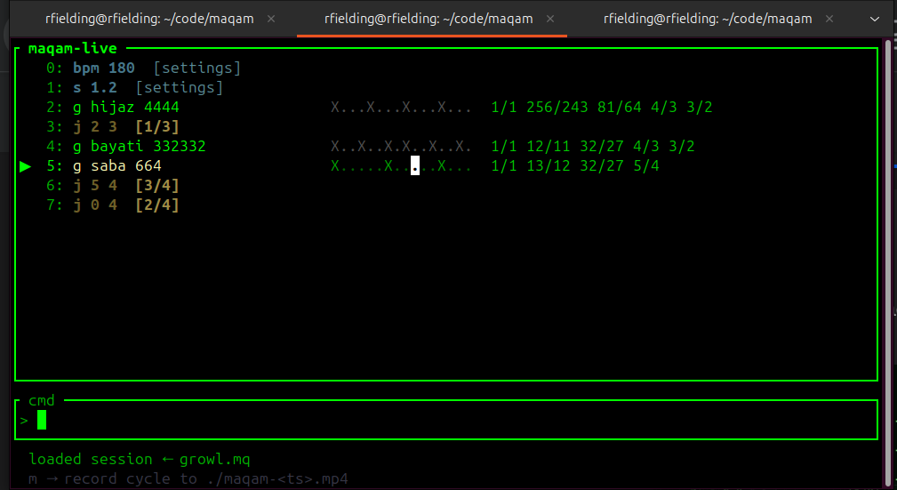

# maqam-live

A real-time terminal sequencer for Arabic maqam music using just intonation synthesis.
Live-code phrases of stacked jins, and record to MP4 with a woven score background.



The woven carpet image above is a visual target for generated score backgrounds. It is not loaded at runtime; backgrounds are generated from the current score when you press `m`, with maqam-colored borders, border-band legend text, and jump arrows layered into the carpet.

```
┌─ maqam-live ──────────────────────────────────────────────────────────────────┐
│ ▶  0: d bayati 332          X..X..X.  1/1 12/11 32/27 4/3 3/2               │
│    1: j 0 3                           [1/3]                                   │
│    2: a nahawand 332        X..X..X.  1/1 9/8 32/27 4/3 3/2                  │
│    3: c rast 44             X...X...  1/1 9/8 27/22 4/3 3/2                  │
└───────────────────────────────────────────────────────────────────────────────┘
│ ▶ cmd                                                                         │
│   BPM:120 sus:1.2s vol:1.00 phrases:4  [?] help  [z] pause                  │
│   m → record cycle to ~/maqam-<ts>.mp4                                       │
└───────────────────────────────────────────────────────────────────────────────┘
```

## Build

Recommended prerequisites:

- Install Rust with `rustup`: <https://rustup.rs/>
- Install `ffmpeg` and make sure the `ffmpeg` executable is available on your `PATH` if you want MP4 recording to work

```bash
cargo build --release
cargo run --release
```

---

## Concepts

### Jins (plural: ajnas)

A jins is a short scale fragment — the basic harmonic unit of Arabic maqam.
maqam-live treats each jins as its own chord: a set of JI ratios that define
the current harmonic field. Most jins span five notes (root through fifth);
Saba is an exception at four notes with a characteristic major-third endpoint.

The melody walks through the jins notes using a zigzag contour that evolves
slightly each repetition.

### Rhythm groups

Rhythm is specified as a string of non-zero digits. Each digit is a group size —
the number of subdivisions in that group. The first subdivision of each group
is a kick (X), the rest are snares (.).

```
332   →  X..X..X.   (8 subdivisions: 3+3+2)
44    →  X...X...   (8 subdivisions: 4+4)
4444  →  X...X...X...X...  (16 subdivisions)
664   →  X.....X.....X...
21    →  X.X
```

### Stacking ajnas

Separate two jins specs with a comma to stack them into one combined scale.
The melody walks through both jins together.

```
d bayati, a nahawand 332    →  D natural minor (Bayati lower + Nahawand upper)
d hijaz, a kurd 44          →  D Hijaz Kar
d rast, a rast 332          →  D Rast full octave
```

---

## Commands

### Add a phrase

```
<root> <jins> [rhythm]
<root> <jins>, <root> <jins> [rhythm]       ← stacked
<root> <jins> [rhythm] r<N>                 ← repeat N times
```

```
d bayati 332
d hijaz 4444
a nahawand 44 r3
d bayati, a nahawand 332
```

Root names: `c  d  e  f  g  a  b`
Append `+` or `-` for sharp/flat: `d+  f-  g+`

Jins names can be abbreviated to any unambiguous prefix:
`nah  bay  hij  ras  kur  sab  aja  nik  suz  jih  zab`

Rhythm defaults to the last rhythm used, so you can omit it after the first phrase.

---

### Sequence control

#### Jump

```
j <id> [times]
```

Add a jump entry that loops back to phrase `id` a total of `times` times,
then falls through to the next phrase.

```
d bayati 332          ← phrase 0
j 0 4                 ← loop bayati 4× before continuing
c rast 332            ← phrase 2: plays after the 4th bayati
```

A warning kick sounds on the last kick beat of the last bayati before rast begins.

#### Insert

```
i <id> <phrase>                 ← insert phrase before id
i <id> j <target> [times]       ← insert jump entry before id
i <id> bpm <n|+n|-n|*k|/k>      ← insert BPM settings entry before id
i <id> s <n|+n|-n|*k|/k>        ← insert sustain settings entry before id
i <id> vcf <target> <cut> [res] [drive] [wave] ← insert VCF/VCO settings entry before id
```

```
i 2 f hijaz 332                 ← insert hijaz before phrase 2
i 1 j 0 3                       ← insert "loop back to 0, 3 times" before phrase 1
i 1 bpm 180                     ← insert a tempo change before phrase 1
i 1 sus 1.5                     ← insert a sustain change before phrase 1
i 1 vcf bass 900 0.65 3.5 wave=saw ← insert a bass filter change before phrase 1
```

#### Edit

```
edit <id> <phrase>              ← replace with a phrase
edit <id> j <target> [times]    ← replace with a jump entry
edit <id> bpm <n|+n|-n|*k|/k>   ← replace with a BPM settings entry
edit <id> s <n|+n|-n|*k|/k>     ← replace with a sustain settings entry
edit <id> vcf <target> <cut> [res] [drive] [wave] ← replace with a VCF/VCO settings entry
```

```
edit 2 d kurd 44                ← change phrase 2 to D Kurd with rhythm 44
edit 1 j 0 6                    ← change phrase 1 to loop 6 times
edit 1 bpm 180                  ← change entry 1 to a tempo change
edit 1 sus 1.5                  ← change entry 1 to a sustain change
edit 1 vcf kanun cut=900 res=0.65 drive=3.5 wave=tri
```

Editing the currently-playing phrase is blocked.

#### Delete

```
x <id> [id …]
```

```
x 3
x 1 2 4
```

#### Rotate

```
rot
```

Moves the last phrase to the front of the list.

#### Reorder

```
up <id>
down <id>
```

Moves any entry, including jumps and settings lines, by one slot.

---

### Settings

```
bpm <n>         tempo in BPM (20–400), default 120
bpm <+n|-n|*k|/k>   relative tempo change from current BPM
s <n>           sustain in seconds (0.05–10), default 1.25
s <+n|-n|*k|/k>     relative sustain change from current value
vcf <target> <cut> [res] [drive] [wave] Moog-ish VCO into low-pass VCF, default off
vcf off         bypass VCF entirely
vcf all off     bypass VCF entirely and clear per-instrument filters
vcf <target> off disable VCF for one target
vcf targets: all, bass, kanun, kick
vcf wave must be named: wave=sin, wave=tri, wave=squ, wave=saw
cut <n>         update VCF cutoff in Hz (10–22000)
cut=+2t         move VCF cutoff by +2 every sequencer tick
cut=+0          stop cutoff movement for that target
res <n>         update VCF resonance (0–0.98)
drive <n>       update VCF drive (0.1–12)
reverb mix=<n> decay=<n>  reverb, default mix 0.18 decay 0.65
delay time=<s> feedback=<n> mix=<n>  ping-pong delay, alias: pingpong
fx off          disable reverb and delay
vol <n>         volume multiplier (0–2), default 1.0
```

```
bpm 180
bpm *2
s 2
s *0.8
vcf bass 900 0.65 3.5 wave=saw
vcf bass cut=+2t
vcf bass cut=+0
vcf kanun cut=2400 res=0.35 drive=2.0 wave=tri
vcf kick cut=700 res=0.25 drive=2.5 wave=squ
vcf all off
reverb mix=0.25 decay=0.7
pingpong time=0.33 feedback=0.45 mix=0.2
delay feedback=+0.01t
delay feedback=+0
fx off
cut +100
vol 0.8
```

`bpm ...`, `s ...`, and `vcf ...` add settings entries to the sequence as well as updating
the current global playback state, so they can be moved with `up`/`down` and
saved directly into `.mq` sessions.

---

### Playback

```
z               toggle pause / play (restarts from phrase 0 on unpause)
z <id>          seek to phrase id without toggling pause
```

---

### Session files

```
save [file]     save current session to a .mq file
load <file>     load a session from a .mq file
clear           remove all sequence entries
```

Example:

```
save firstSong.mq
load firstSong.mq
load firstSong.mq; save firstSong.mq
bpm *2; s *0.8; save firstSong.mq
```

Saved `.mq` files use the explicit-ID `MAQAM_SESSION_V3` format, so you will
see timeline records such as `B|0|240`, `S|1|1.0`, and `P|2|1|g hijaz 4444`.
Custom jins are persisted as `create <Name> ...` lines and restored on load.

If a session has been loaded or previously saved, bare `save` reuses that path.

---

### Recording

```
m               record one cycle to ./maqam-<timestamp>.mp4
m <n>           record n cycles
```

The MP4 is written to the current directory. Its background is generated from
the current score/session when recording starts. The long-term visual target is
a woven carpet-like score map with hidden Hilbert locality, ratio/rhythm stitch
ornament, shared embroidered territories, and the terminal HUD layered on top.

---

### Jins registry

The jins registry is live-editable at runtime.

### Notes on sound

The melody voice is additive, not true FM: it is a sine plus fixed 2nd and 3rd
harmonics. The sub-bass is also pure sine, but each phrase start stacks several
octaves of the root at different gains, which can create a square-ish or
triangle-ish impression through interference and speaker/headphone resonance.

```
audition <Name>                          ← preview a jins in a slow loop
audition <root> <Name>[, <root> <Name>] ← preview a stacked mixed scale
ls                                      ← list all jins with ratios
create <Name> <p/q> <p/q> …            ← create or overwrite a jins
delete <Name>                           ← remove it
```

Names are case-insensitive. `create` normalizes to title case.

```
audition Hijaz                           ← preview Hijaz without changing the session
audition d bayati, f hijaz              ← preview a mixed Bayati/Hijaz stack
create Zaba 1/1 12/11 32/27 11/8       ← add the "Zaba" jins
create Saba 1/1 13/12 32/27 80/64      ← redefine Saba
delete Zaba                             ← remove it
ls                                      ← see the full list
```

---

### Other

```
? / help        show command help
q / quit        quit
;               separate multiple commands on one line
```

Built-in jins:

| Name      | Ratios                              | Character              |
|-----------|-------------------------------------|------------------------|
| Nahawand  | 1/1 9/8 32/27 4/3 3/2              | Natural minor          |
| Bayati    | 1/1 12/11 32/27 4/3 3/2            | Neutral 2nd            |
| Hijaz     | 1/1 256/243 81/64 4/3 3/2          | Augmented 2nd          |
| Rast      | 1/1 9/8 27/22 4/3 3/2              | Neutral 3rd            |
| Kurd      | 1/1 256/243 32/27 4/3 3/2          | Phrygian               |
| Saba      | 1/1 13/12 32/27 80/64              | Major-3rd endpoint     |
| Zaba      | 1/1 12/11 32/27 11/8               | Tritone endpoint       |
| Ajam      | 1/1 9/8 5/4 4/3 3/2                | Major                  |
| Nikriz    | 1/1 256/243 81/64 4/3 3/2          | Hijaz lower            |
| Suznak    | 1/1 9/8 27/22 4/3 3/2              | Rast lower             |
| Jiharkah  | 1/1 9/8 5/4 4/3 3/2                | Ajam lower             |

---

### Multiple commands

Separate commands with `;` to run them on one line:

```
d bayati 332; j 0 3; c rast 332
bpm 160; s 1.5; vol 0.9
```

---

## Rhythm vocabulary

These patterns have distinct musical characters:

| Pattern | Shape       | Character                                  |
|---------|-------------|--------------------------------------------|
| `332`   | X..X..X.    | Travelling, forward momentum               |
| `44`    | X...X...    | Open, spacious                             |
| `4444`  | X...×4      | Steady pulse, meditative                   |
| `44332` | X...X...X..X..X. | Minor turnaround (pulse then cadence) |
| `332332`| X..X..X.×2  | Major turnaround, two cadential cycles     |
| `664`   | X.....X.....X... | Deceleration, ending feel             |
| `21`    | X.X         | Tight, urgent                              |

---

## Full workflow example

```
bpm 140
s 1.5

d bayati 332
j 0 3
a nahawand 332

m 2
```

This creates:
- Phrase 0: D Bayati, rhythm 332
- Phrase 1: jump back to phrase 0, 3 total loops
- Phrase 2: A Nahawand, rhythm 332 (inherits from previous)

Then records 2 full cycles to a timestamped MP4.

---

## Extended example: building a taqsim-style sequence

```
bpm 120
s 2

d bayati 332              ← open on D Bayati
j 0 4                     ← circle it 4 times
d bayati, a nahawand 332  ← expand to full D natural minor
j 2 2                     ← repeat twice
f hijaz 44                ← move to F Hijaz for contrast
j 4 2
d bayati 664              ← return, decelerating rhythm
j 6 2
```

```
m 3                       ← record 3 cycles
```

At any point you can edit a phrase without stopping:

```
edit 4 f hijaz, c kurd 44     ← add upper Kurd to the Hijaz phrase
edit 1 j 0 6                  ← loop Bayati longer before moving on
x 7                           ← remove the last phrase
```

---

## Acoustic notes

With `sus 2` and `bpm 180`, sustained phrases overlap — notes from the
previous phrase are still ringing when the next begins. At these settings
the JI intervals create standing wave interference patterns that can produce
formant-like resonances in the 11-limit range (12/11, 11/10, 11/8).

The Saba/Zaba combination is particularly striking:

```
bpm 180
s 2
d saba 4444; d zaba 4444; f saba 4444
```

The 11-limit intervals (11/8 in Zaba) activate vocal-tract-like resonances
that some listeners perceive as acoustic hallucinations — voice-like sounds
emerging from the interference between overlapping JI standing waves.

---

## Source

https://github.com/rfielding/maqam
