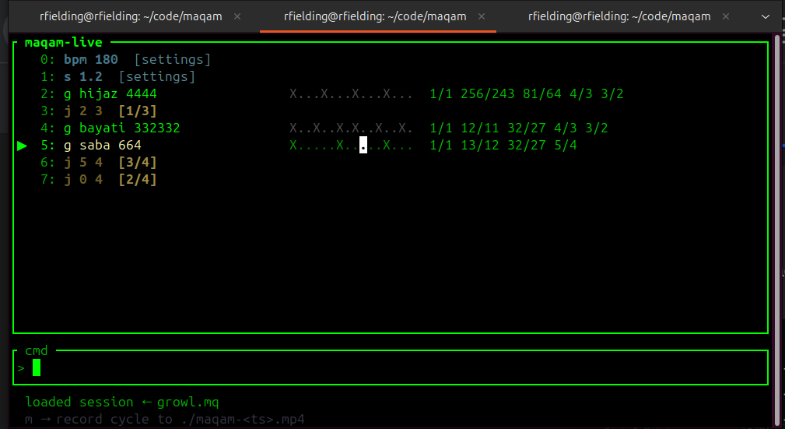

# maqam-live

A real-time terminal sequencer for Arabic maqam music using just intonation
synthesis. It is built for live-coding short maqam phrases, moving through a
timeline of phrases and control entries, shaping the sound with per-instrument
VCF/VCO settings and score-aware effects, and rendering the current score to
MP4.



The screenshot is a visual target for generated score backgrounds. At runtime,
recording generates a background from the current session and overlays the
terminal HUD.

## Demo

[](https://cdn.jsdelivr.net/gh/rfielding/maqam@main/maqam-demo-v2.mp4)

[Play the demo MP4](https://cdn.jsdelivr.net/gh/rfielding/maqam@main/maqam-demo-v2.mp4)

## Build

Prerequisites:

- Rust, via `rustup`: <https://rustup.rs/>
- Linux audio development headers if building on Linux, for example
  `libasound2-dev pkg-config`
- `ffmpeg` on `PATH` if you want MP4 recording

```bash
cargo build --release
cargo run --release
```

The package default binary is `maqam-live`. If command-line arguments are
provided, the app runs those commands without opening the TUI:

```bash
cargo run --release -- "load default.mq" -- "m 1"
```

Use `--` between command groups when a single shell invocation should run
multiple maqam-live commands.

## Get Unstuck

The default way to get help while using the TUI is to ask an LLM from the
command box. Use this when you forget valid values, command syntax, or which
control affects which sound.

```text
chatgpt: what are the valid values for sym decay?
chatgpt: how do i set a vcf filter on the instrument only?
claude: how do i get sympathetics?
claude: what should i type to turn off the bass vcf?
chatgpt: find me a Metallica NAM amp capture
chatgpt: let's do an e minor that does a d major hemiola turnaround
```

`chatgpt:` requires `OPENAI_API_KEY` in the environment. `claude:` requires
`ANTHROPIC_API_KEY` or `CLAUDE_API_KEY`. Optional model overrides are
`OPENAI_MODEL` and `ANTHROPIC_MODEL`.

Good answers should tell you what to type, not just describe the concept. For
example, a valid-values question should come back with a command form such as:

```text
Use sym decay with a value from 0.9 to 0.99999, like sym decay 0.999.
```

The LLM sees a generated language reference built from maqam-live's command
metadata: command nouns, valid patterns, parameter limits, typical values, and
plain-language descriptions. Press `?` in the TUI to read that same reference in
the help overlay.

If the API key is missing, maqam-live tells you exactly which environment
variable to set before trying again.

For NAM amp/capture discovery requests, maqam-live runs its web lookup tool
before asking the LLM, then the LLM explains the real result links or direct
`nam import URL as name` commands. Use `PageUp` and `PageDown` to scroll longer
responses in the TUI.

LLM edits must begin with `chatgpt:` or `claude:`. When the prompt is an edit
request, maqam-live uses tool calling to get a structured command list, checks
every command, then applies them. The model is never allowed to run `save`;
save explicitly when you are happy with the result.

## Concepts

### Jins And Maqam

A jins is a short scale fragment. maqam-live treats each phrase as one or more
stacked ajnas, all tuned as exact just-intonation ratios. A single jins phrase
uses the notes available in that fragment. A comma stacks ajnas into one
combined scale:

```text
d bayati 332
d bayati, a nahawand 332
d hijaz, a kurd 44
```

Root names are `c d e f g a b`. Append `+` or `-` for sharp/flat-like oud
lattice positions, for example `d+` or `f-`.

Built-in jins names can be abbreviated to an unambiguous prefix:

```text
nah bay hij ras kur sab aja nik suz jih zab zam
```

### Rhythm Groups

Rhythm is written as non-zero digits. Each digit is a group size. The first
subdivision of a group is a kick (`X`), and the remaining subdivisions are
snares (`.`).

```text
332   ->  X..X..X.
44    ->  X...X...
4444  ->  X...X...X...X...
664   ->  X.....X.....X...
21    ->  X.X
```

If a phrase omits rhythm, it inherits the last rhythm used.

### Direction: Context-Aware Effects

maqam-live is moving toward effects units that receive musical context directly
from the score. A conventional audio effect sees only a waveform and must try to
reverse engineer pitch, tuning, phrase boundaries, repetition, and likely
transitions before it can respond musically. This project already knows that
structure: the exact JI ratios, current and next phrases, timeline controls,
jumps, repeat counters, and playback position are all explicit.

The `sym` sympathetic-strings box is the first effect in this direction. Live
audio supplies energy, while the score determines which virtual strings can
accept that energy. By default it behaves like:

```text
sym harmony root 1.0
```

That means the active phrase retunes the sympathetic bank to the phrase's exact
JI pitches, lifted into the string register. On a phrase change, newly tuned
strings begin accepting energy, while strings already ringing retain their
accumulated energy and decay audibly to zero. The effect therefore follows the
composition without estimating its structure from the input signal.

### Weighted Sympathetic Harmony

The unusual part is that `sym` can distribute one unit of resonator energy
across JI harmonic targets:

```text
sym harmony root 0.50 third 0.25 fifth 0.25
```

This sends half of the sympathetic target energy to the written pitch, one
quarter to the just minor third above it (`6/5 * f0`), and one quarter to the
just fifth (`3/2 * f0`). The weights are normalized to a total of `1.0`, so this
is a harmonic distribution, not a gain boost.

You can also use `major-third` for `5/4 * f0`, `fourth` for `4/3 * f0`,
`octave` for `2/1 * f0`, or an explicit ratio:

```text
sym harmony root 0.40 major-third 0.20 fourth 0.20 octave 0.20
sym harmony root 0.50 5/4 0.25 3/2 0.25
```

This gives just intonation the behavior of a synth voice or resonator bank:
instead of only exciting the fundamental, the score can decide how sympathetic
energy is split into harmonic intervals for the current phrase.

The string model uses harmonic metal-string courses, jawari-like nonlinear
bridge coloration, and independent slow pitch drift around each exact JI
center. Score vocabulary can expose sympathetic target harmony, level, timbre,
modulation, and freeze as timeline controls rather than requiring pedal-state
automation outside the composition.

The larger goal is a vocabulary of score-aware effects: processors whose
tuning, excitation, damping, movement, and transitions can follow written
musical intent while still operating on a live input stream.

## Commands

### Phrases

```text
<root> <jins> [rhythm]
<root> <jins>, <root> <jins> [rhythm]
<root> <jins> [rhythm] r<N>
```

Examples:

```text
d bayati 332
a nahawand 44 r3
d bayati, a nahawand 332
```

### Timeline Control

The sequence is a timeline of musical phrases plus control entries. IDs are
stable: deleting or moving entries does not renumber existing IDs.

```text
j <id> <times>                       jump back to id, then fall through; times 1 is a no-op
j start [times]                      jump to the current top timeline item
i <id> <command>                     insert before id
edit <id> <command>                  replace an entry
x <id> [id ...]                      delete entries
up <id> / down <id>                  move an entry one slot
rot                                  move the first entry to the end
stop                                 add a renderer stop line
```

Examples:

```text
d bayati 332
j 0 4
c rast 332
i 2 f hijaz 332
edit 1 j 0 6
x 3
```

### Playback

```text
z                  toggle sound/playback off or on
z <id>             queue phrase id as the next destination
z start            queue the current top timeline item
start              shorthand for z start
pause              alias for toggling pause/play
sym / sym on       excite maqam-tuned sympathetic strings from default input
sym off            disable live-input sympathetic strings
sym decay <n>      set string retention per millisecond (0.9..0.99999; default 0.999)
sym gain <n>       set live-input excitation gain (0..512; default 2)
sym drive <n>      alias for sym gain
sym decay <n> drive <n> kanun <n> bass <n>
                   combined sym settings; omitted values stay unchanged
sym harmony root 0.50 third 0.25 fifth 0.25
                   split sympathetic target energy across JI harmonic targets
sym <mic|kanun|bass|drums> decay <n> drive <n> amount <n>
                   per-source sympathetic partition settings
vcf sym ...        filter the sympathetic-string instrument bus
nam import metallica.nam as metallica
                   cache a Neural Amp Modeler A1/A2 capture
nam import https://example.com/amp.nam as amp
                   download a capture into ./.nam with a progress meter
nam metallica.nam cache and load a NAM capture from the current directory
nam https://example.com/amp.nam
                   download, cache, and load a NAM capture
nam <name>         load a cached NAM capture on live mic input
nam ls            list cached NAM captures and current-directory .nam files
nam search <query>
                  search the web for real NAM captures and direct downloads
nam pin <URL> as <name>
                  pin, download, and load one exact model; updates the loaded .mq
nam tone3000 <tone-id> as <name>
nam login
nam logout
                  pin a canonical TONE3000 tone and load its A2 model
nam gain <n>      set NAM input gain before the amp model (0..8)
nam input left|right|stereo
                  select channel 1, channel 2, or an equal mono mix
nam latency left|right
                  compare device capture and predicted playback timestamps
nam off           bypass the live-input NAM model
q / quit           quit
? / help           show help
PageUp/PageDown    scroll the response pane
;                  separate multiple commands on one line
```

NAM model, gain, bypass, and input-routing commands are numbered timeline rows:
they can be moved, rotated, inserted, edited, saved, and scheduled. For example,
`i 12 nam gain 6`, `edit 12 nam off`, or `edit 12 nam input right`.
`nam pin URL as name` also replaces the score's ambiguous
`nam name` line with the exact downloadable source. Other machines then fetch
the same capture into their local cache when loading that score.
`nam tone3000 ID as name` pins a canonical catalog identity instead. On first
use, Maqam automatically opens TONE3000 authorization in the system browser and
waits for the OAuth callback on localhost in a background thread, so playback
and the TUI continue. No API-key setup or login command is required.
The credential is kept in the ignored, owner-only `.tone3000-auth.json` file and
refreshed automatically; `nam logout` removes it. `TONE3000_ACCESS_TOKEN` remains
available for headless use, and `TONE3000_CLIENT_ID` can override the bundled
publishable client ID during development. An authenticated maqam-live resolves and downloads its A2 model via
the authenticated TONE3000 API.
The input chain is selected input -> NAM -> `vcf mic` or `vcf all`. `stereo`
mixes both hardware channels equally before the mono NAM model. Referenced
captures are cached in `./.nam` by default, or in `MAQAM_NAM_CACHE_DIR` when
set. The cache directory is created automatically when listing, importing, or
downloading captures. Downloads show a progress meter in the TUI. Incomplete
downloads stay as `.nam/<name>.nam.part`; run the same `nam import ...` command
again to resume when the server supports HTTP Range requests. If the server does
not support resume, maqam-live restarts the download from zero. NAM models have
an expected sample rate. maqam-live uses the audio device's default output rate
unless you set one explicitly, such as `MAQAM_SAMPLE_RATE=48000 maqam-live`.
Slimmable NAM captures use their lightest submodel by default so the audio
callback can keep up; set `MAQAM_NAM_SLIM=1.0` to force the full model.

The TUI continuously displays CoreAudio's capture-to-predicted-playback timing
as `lat L:<ms> R:<ms>`. Left and right are reported separately, though an
interleaved hardware device will normally give both channels the same timestamp.

### Settings Entries

These commands update current state and also append a timeline entry, so they
can be moved, edited, saved, loaded, and replayed as part of the piece.
The `sym` on/off, gain/drive, and decay commands above are timeline entries as
well. Combined `sym` lines follow the same named-parameter style as VCF: only
the values present on the line change. `sym mic ...`, `sym kanun ...`,
`sym bass ...`, and `sym drums ...` partition decay/drive/amount by source, so
live mic can ring harder and longer than the internal kanun or bass feeds.

```text
bpm <n|+n|-n|*k|/k>                  tempo, range 20..400
s <n|+n|-n|*k|/k>                    sustain seconds, range 0.05..10
sus <n|+n|-n|*k|/k>                  same as s
vol <n>                              live volume multiplier, range 0..2
tuneto <pitch>                       live tuning reference, e.g. tuneto c or tuneto b-
```

Examples:

```text
bpm 180
bpm *2
s 1.5
s *0.8
vol 0.8
```

`vol` and `tuneto` are live-only settings. They are not saved in sessions, and
legacy `vol` lines are ignored when loading.

### VCF And VCO

The VCF is off by default. It is a Moog-ish resonant low-pass filter. The
filter can be applied to one master mix (`all`) or per item (`mic`, `bass`,
`kanun`, `drums`, `sym`). `kick` remains an alias for `drums`. Enabling `all`
disables the per-item filters.
Enabling a per-instrument filter disables `all` but leaves other per-instrument
filters alone.

```text
vcf off
vcf all off
vcf <all|mic|bass|kanun|drums|kick|sym> off
vcf <target> <cutoff> [res] [drive]
vcf <target> cut=<hz|+n|-n|*k|/k|+nt> res=<n> drive=<n> wave=<shape>
cut <hz|+n|-n|+nt>
res <n|+n|-n|+nt>
drive <n|+n|-n|+nt>
```

Wave names must be named parameters. `vcf all` ignores wave specs because it
filters the final outgoing waveform after all item VCOs have already rendered:

```text
wave=sin
wave=tri
wave=squ
wave=saw
wave=mic       redundant for the mic target; mic VCF input is always live mic
```

Examples:

```text
vcf bass 900 0.65 3.5 wave=saw
vcf kanun cut=2400 res=0.35 drive=2.0 wave=tri
vcf drums cut=700 res=0.25 drive=2.5 wave=squ
vcf mic cut=1800 res=0.20 drive=1.2
vcf bass cut=+2t
vcf bass cut=+0
vcf all off
```

Relative changes only affect the parameter named. Tick changes such as
`cut=+2t` add that amount on each sequencer tick. `cut=+0`, `res=+0`, and
`drive=+0` stop movement for that parameter.

### FX

Reverb and ping-pong delay use the same named-parameter and relative-change
rules as VCF. They are off by default.

```text
reverb on
reverb off
reverb mix=<0..1> decay=<0..0.98>
delay on
delay off
delay time=<0.01..2> feedback=<0..0.95> mix=<0..1>
pingpong time=<0.01..2> feedback=<0..0.95> mix=<0..1>
fx off
```

Examples:

```text
reverb mix=0.25 decay=0.7
pingpong time=0.33 feedback=0.45 mix=0.2
delay mix=+0.1
delay feedback=+0.01t
delay feedback=+0
fx off
```

Delay and reverb are more expensive than the VCF in the real-time callback.
For heavy sessions, prefer `cargo run --release` or a built release binary.

### Sessions

```text
save <file>
save                 reuse last loaded/saved path
load <file>
clear
```

Saved sessions use `MAQAM_SESSION_V3`, with explicit stable IDs. Records include:

```text
P|id|repeat|phrase
J|id|target_id|times
B|id|bpm
S|id|sustain
V|id|vcf command
F|id|fx command
Y|id|sym command
T|id|stop
create <Name> <ratio> ...
```

The loader accepts V3 plus older V1/V2 session formats.

Tab completion works for `save` and `load` paths. For `load`, completion looks
for `.mq` files recursively when the partial path has no slash, lists ambiguous
matches, and completes a unique match or common prefix. Pressing Tab after
`edit <id>` fills in that entry's current command text.

### Recording

```text
m
m <n>
m<n>
```

Records one or more cycles to `./maqam-<timestamp>.mp4`. Recording runs on a
worker thread and reports progress in the TUI. Offline rendering uses the same
synth, VCF bank, and FX settings as live playback. The recorder yields during
CPU-heavy synthesis and runs ffmpeg at lower priority with single-threaded
x264 encoding so live audio has scheduling room.

### Jins Registry

The jins registry is editable at runtime.

```text
ls
audition <Name>
audition <root> <Name>[, <root> <Name> ...]
create <Name> <p/q> <p/q> ...
delete <Name>
```

Examples:

```text
audition Hijaz
audition d bayati, f hijaz
create Zaba 1/1 12/11 32/27 11/8
delete Zaba
ls
```

Custom jins are saved as `create` lines and restored before phrases are loaded.

### MIDI Clock

These commands are handled by the app before the main parser:

```text
clockin <device>       receive MIDI clock and sync BPM
clockout <device>      send MIDI clock at current BPM
```

`clockout` receives later BPM updates from the app.

## Built-In Jins

| Name | Ratios | Character |
|---|---|---|
| Nahawand | `1/1 9/8 32/27 4/3 3/2` | Natural minor |
| Bayati | `1/1 12/11 32/27 4/3 3/2` | Neutral second |
| Hijaz | `1/1 256/243 81/64 4/3 3/2` | Augmented second |
| Rast | `1/1 9/8 27/22 4/3 3/2` | Neutral third |
| Kurd | `1/1 256/243 32/27 4/3 3/2` | Phrygian |
| Saba | `1/1 13/12 32/27 80/64` | Major-third endpoint |
| Zaba | `1/1 12/11 32/27 11/8` | Tritone endpoint |
| Zamzam | `1/1 16/15 32/27 6/5` | Minor-third endpoint |
| Ajam | `1/1 9/8 5/4 4/3 3/2` | Major |
| Nikriz | `1/1 256/243 81/64 4/3 3/2` | Hijaz lower |
| Suznak | `1/1 9/8 27/22 4/3 3/2` | Rast lower |
| Jiharkah | `1/1 9/8 5/4 4/3 3/2` | Ajam lower |
| Major | `1/1 9/8 5/4 4/3 3/2 5/3 15/8` | 5-limit Ionian |
| Ionian | `1/1 9/8 5/4 4/3 3/2 5/3 15/8` | Major alias |
| Dorian | `1/1 9/8 6/5 4/3 3/2 5/3 9/5` | Minor third, major sixth |
| Phrygian | `1/1 16/15 6/5 4/3 3/2 8/5 9/5` | Flat second |
| Lydian | `1/1 9/8 5/4 45/32 3/2 5/3 15/8` | Sharp fourth |
| Mixolydian | `1/1 9/8 5/4 4/3 3/2 5/3 9/5` | Major third, minor seventh |
| Minor | `1/1 9/8 6/5 4/3 3/2 8/5 9/5` | 5-limit Aeolian |
| Aeolian | `1/1 9/8 6/5 4/3 3/2 8/5 9/5` | Natural minor alias |
| Locrian | `1/1 16/15 6/5 4/3 64/45 8/5 9/5` | Flat fifth |
| Diminished | `1/1 9/8 6/5 4/3 64/45 8/5 5/3 15/8` | Octatonic whole-half |

## Example

```text
bpm 140
s 1.5
vcf bass 900 0.65 3.5 wave=saw
reverb mix=0.18 decay=0.7

d bayati 332
j 3 3
a nahawand 332
pingpong time=0.33 feedback=0.42 mix=0.2
d bayati, a nahawand 664

m 2
```

## Source

https://github.com/rfielding/maqam
