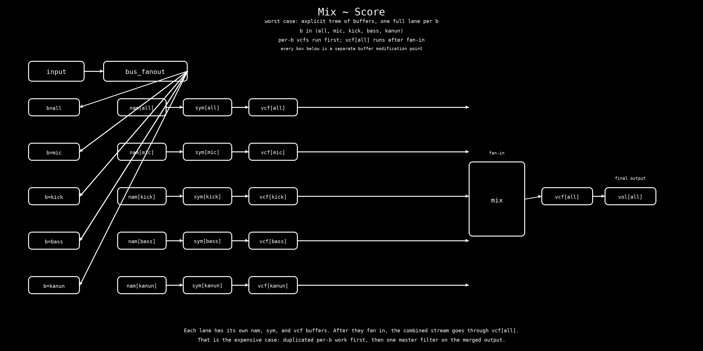

# Bus And Effects Order

This page describes the current live audio path in `maqam-live`.

## Processing Order

At runtime, the callback processes sound in this order:

1. capture the hardware input
2. run the selected input through NAM, if enabled
3. render voices into their dry buses
4. feed sympathetic strings from the live input and instrument buses
5. apply VCF routing
6. apply global FX
7. apply output volume and final clipping

The important split is this:

```text
input -> bus_fanout[b] -> nam[b] -> sym[b] -> vcf[b] -> mix -> vcf[all] -> vol[all]
```

Here `b` ranges over `all`, `mic`, `kick`, `bass`, and `kanun`.
The per-b `vcf` boxes run first. The master `vcf[all]` runs after fan-in.

That is the worst-case work path when the score is driving all active buses at
once.

## Worst Case

This is the loaded case: score fans out to all the active buses at once, the
mix stage pulls them back together, and the post-mix FX stack keeps going with
chorus, flanger, echo, and reverb.



## `sym`

`sym` stands for sympathetic strings.

- It is not a live-input amp model.
- It receives energy from:
  - live input
  - kanun voices
  - bass voices
  - drums voices
- It has four partitions internally:
  - `mic`
  - `kanun`
  - `bass`
  - `drums`

The parser accepts `sym` and `sympathetics` as the control noun. Internally, the
VCF target name for this bus is `sym`, while the sympathetic engine still keeps
its own `mic`, `kanun`, `bass`, and `drums` partitions.

Practical effect:

- `sym on` opens the bridge to new energy
- already ringing strings keep decaying after `sym off`
- `sym` can feed the master mix or its own `vcf sym` bus, depending on the
  active VCF layout

## `nam`

`nam` is the Neural Amp Modeler stage for live input.

- It runs on the selected hardware input before VCF.
- Input routing is `left`, `right`, or `stereo`.
- `stereo` mixes both channels equally before the mono NAM model.
- `nam off` bypasses the model.
- NAM is live state, not score state, so it is not written into `.mq` session
  files as a musical control lane.

Current chain:

```text
hardware input -> NAM -> vcf mic / vcf all -> FX
```

If `vcf mic` is not enabled, the NAM output still remains audible through the
main mix path, and `vcf all` can process the final combined stereo output.

## `vcf`

`vcf` is the resonant filter bank.

Targets:

- `all`
- `mic`
- `bass`
- `kanun`
- `drums` / `kick`
- `sym`

Rules:

- `vcf all` is the master filter on the final stereo mix.
- Enabling `vcf all` disables the per-target filters.
- Enabling a per-target filter disables `all` but leaves the other per-target
  filters alone.
- The `sym` target filters the sympathetic-string bus.

Order inside the mix:

1. render dry instrument buses
2. add sympathetic output
3. apply per-target VCFs when `all` is off
4. otherwise apply `vcf all` to the final mix
5. send the result to FX

The VCF bank currently uses one filter slot each for:

- live mic input
- bass
- kanun
- drums
- sympathetic strings

## Practical Summary

If you want to think about the system as a pedalboard:

- `nam` is the amp/capture on the live input
- `sym` is the score-aware resonator layer
- `vcf` is the filter stage that can live on a bus or on the whole mix
- FX comes after that

The current release docs and command reference stay in `README.md`; this page is
just the bus-order reference for people changing the audio path.
